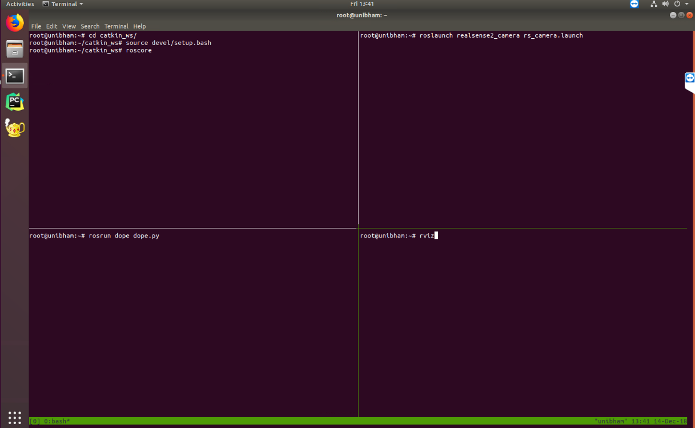

[](https://creativecommons.org/licenses/by-nc-sa/4.0/legalcode)

# Deep Object Pose Estimation - ROS Inference  (RealSenseD435)

# Disclaimer
This README has been modified from the original repo to contain instructions only for setting up the Docker image I've built to work with the Intel RealSenseD435 camera. I've kept images, paragraphs and sentences untouched and added some of my own to the original README file. 
The Docker image should have you up and running with an Intel RealSense D435 out of the box. In case you want to do it form scratch, please have a [look here](https://github.com/intel-ros/realsense/#installation-instructions).

# Instructions
This is the official DOPE ROS package for detection and 6-DoF pose estimation of **known objects** from an RGB camera.  The network has been trained on the following YCB objects:  cracker box, sugar box, tomato soup can, mustard bottle, potted meat can, and gelatin box.  For more details, see our [CoRL 2018 paper](https://arxiv.org/abs/1809.10790) and [video](https://youtu.be/yVGViBqWtBI).

*Note:*  Currently this package contains inference only.


## Installing

1. **Install Nvidia-Docker**
   Please follow the [Nvidia-Docker quickstart installation](https://github.com/NVIDIA/nvidia-docker)
   
2. **Pull the Docker image**

   ```
   nvidia-docker pull pauloabelha/nvidia-dope-realsensed435
   ```
   Pulling the image might take several minuts. Once the pull finishes, please check if the image is available for nvidia-docker:
   ```
   nvidia-docker images
   ```   
   
   You should see something similar to:
   ```
   cvlab@unibham:~$ nvidia-docker images
   REPOSITORY                             | TAG                     | IMAGE ID            | CREATED             | SIZE
   pauloabelha/nvidia-dope-realsensed435  | latest                  | c002a2f82c69        | 14 hours ago        | 7.45GB
   nvidia-dope                            | kinetic-v1              | efca8e87496b        | 19 hours ago        | 7.16GB
   nvidia/cuda                            | 9.0-base                | 74f5aea45cf6        | 4 weeks ago         | 134MB
   nvidia/cudagl                          | 9.0-devel-ubuntu16.04   | b953c82b3472        | 6 weeks ago         | 2GB
   ```
   Please make sure you can see the realsensed435 image: pauloabelha/nvidia-dope-realsensed435

3. **Clone the DOPE code**  
   ```
   $ cd ~
   $ git clone https://github.com/pauloabelha/Deep_Object_Pose.git dope
   ```
   
4. **Plug in your Intel RealSense D435 camera**  
   Docker will not recognize a USB device that is plugged in after the container is started.
   
5. **Run the container**  
   ```
   $ ./run_dope_docker.sh [name] [host dir] [container dir]
   ```   
   
   Parameters:
   - `name` is an optional field that specifies the name of this image. By default, it is `nvidia-dope-realsensed435`.  By using different names, you can create multiple containers from the same image.  
   - `host dir` and `container dir` are a pair of optional fields that allow you to specify a mapping between a directory on your host machine and a location inside the container.  This is useful for sharing code and data between the two systems.  By default, it maps the directory containing dope to `/root/catkin_ws/src/dope` in the container.  
   
      Only the first invocation of this script with a given name will create a container. Subsequent executions will attach to the running container allowing you -- in effect -- to have multiple terminal sessions into a single container.
      After running the container you should find yourself inside of it at:
      ```
      $ root@unibham:~#`
   
7. **Build**
     ```
     $ cd ~/catkin_ws
     $ catkin_make
     ``` 

8. **Download [the weights](https://drive.google.com/open?id=1DfoA3m_Bm0fW8tOWXGVxi4ETlLEAgmcg)** and save them to the `weights` folder, *i.e.*, `~/catkin_ws/src/dope/weights/`. PLease remember that the docker image path `~/catkin_ws/src/dope/` is linked by default with your dope src path `~/dope/`; this means you can put the downloaded wieght files at your host machine at `~/dope/weights/`.


## Running

1. **(Optional) Use Tmux **

   I have installed [Tmux](https://tmuxcheatsheet.com/) at the container to make things easier for runnign the ROS core, starting the camera and visualizing in RViz. For this, you need to firstly run Tmux
   ```
   $ tmux
   ```
   
   Then press Ctrl+b, release, and press ". This should have split your screen horizontally into two. You can then press Ctrl+b, release, and press %. Now, you should have three screens available in the same terminal. You can swap between them by pressing Ctrl+b and using the arrow keys. FInally, go up to the top screen and split it into two to get 4 screens on your terminal. Below, I'll be referring to the screens by numbers from top left (1), top right (2), bottom left (3), bottom right (4).
   
   
   
   

1. **Start ROS master (optional at screen 1 in Tmux)**
      ```
      $ cd ~/catkin_ws
      $ source devel/setup.bash
      $ roscore
      ```

2. **Start Intel RealSense D435 node (optional at screen 2 in Tmux)** 
      ```
      $ roslaunch realsense2_camera rs_camera.launch`
      ```  

3. **(Optional) Edit config info** (if desired - I have already configured it for listeing to the Intel RealSense D435 topic) in `~/catkin_ws/src/dope/config/config_pose.yaml`
    * `topic_camera`: RGB topic to listen to
    * `topic_publishing`: topic name for publishing
    * `weights`: dictionary of object names and there weights path name, **comment out any line to disable detection/estimation of that object**
    * `dimension`: dictionary of dimensions for the objects  (key values must match the `weights` names)
    * `draw_colors`: dictionary of object colors  (key values must match the `weights` names)
    * `camera_settings`: dictionary for the camera intrinsics; edit these values to match your camera
    * `thresh_points`: Thresholding the confidence for object detection; increase this value if you see too many false positives, reduce it if  objects are not detected. 
    
4. **Start DOPE node (optional at screen 3 in Tmux)**
    ```
    $ rosrun dope dope.py [my_config.yaml]  # Config file is optional; default is `config_pose.yaml`
    ```

    *Note:*  Config files must be located in the `~/catkin_ws/src/dope/config/` folder.
    
5. **Run Rviz for visualization (optional at screen 4 in Tmux)**
    ```$ rviz`

## Debugging

* The following ROS topics are published:
     ```
     /dope/webcam_rgb_raw       # RGB images from camera 
     /dope/dimension_[obj_name] # dimensions of object
     /dope/pose_[obj_name]      # timestamped pose of object
     /dope/rgb_points           # RGB images with detected cuboids overlaid
     ```
     *Note:* `[obj_name]` is in {cracker, gelatin, meat, mustard, soup, sugar}

* To debug in RViz, `rosrun rviz rviz`, then either
  * `Add > Image` to view the raw RGB image or the image with cuboids overlaid
  * `Add > Pose` to view the object coordinate frame in 3D.  If you do not have a coordinate frame set up, you can run this static transformation: `rosrun tf static_transform_publisher 0 0 0 0.7071 0 0 -0.7071 world dope 10`.  Make sure that in RViz's `Global Options`, the `Fixed Frame` is set to `world`. 

* If `rosrun` does not find the package (`[rospack] Error: package 'dope' not found`), be sure that you called `source devel/setup.bash` as mentioned above.  To find the package, run `rospack find dope`. 


## YCB 3D Models

DOPE returns the poses of the objects in the camera coordinate frame.  DOPE uses the aligned YCB models, which can be obtained using [NVDU](https://github.com/NVIDIA/Dataset_Utilities) (see the `nvdu_ycb` command).


## Citation

If you use this tool in a research project, please cite as follows:
```
@inproceedings{tremblay2018corl:dope,
 author = {Jonathan Tremblay and Thang To and Balakumar Sundaralingam and Yu Xiang and Dieter Fox and Stan Birchfield},
 title = {Deep Object Pose Estimation for Semantic Robotic Grasping of Household Objects},
 booktitle = {Conference on Robot Learning (CoRL)},
 url = "https://arxiv.org/abs/1809.10790",
 year = 2018
}
```

## License

Copyright (C) 2018 NVIDIA Corporation. All rights reserved. Licensed under the [CC BY-NC-SA 4.0 license](https://creativecommons.org/licenses/by-nc-sa/4.0/legalcode).


## Acknowledgment 

Thanks to Jeffrey Smith (jeffreys@nvidia.com) for creating the Docker image. 


## Contact

Jonathan Tremblay (jtremblay@nvidia.com), Stan Birchfield (sbirchfield@nvidia.com)
